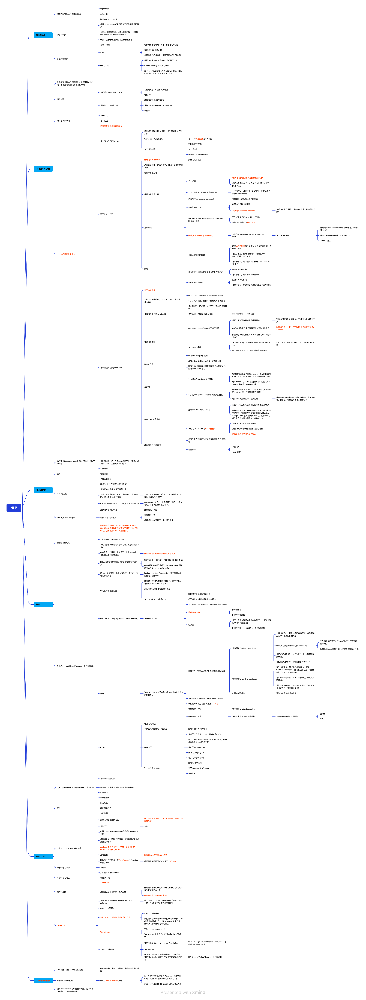

# 《03-深度学习进阶：自然语言处理》

## 目录结构

- `source_code/`：示例源码
  - 重要的代码示例：
    1. [`source_code/ch01/two_layer_net.py`](source_code/ch01/two_layer_net.py) （学习后的神经网络可以正确地捕获“旋涡”这个模式。 模型正确地学习了非线性的区域划分）
    2. [`source_code/common/trainer.py`](source_code/common/trainer.py) 执行神经网络的学习。这个类的初始化程序接收神 经网络(模型)和优化器
    3. [`source_code/ch02/count_method_big.py`](source_code/ch02/count_method_big.py) 使用语料库，计算上下文中的单词数量，将它们转化 PPMI 矩阵，再基于 SVD 降维 获得好的单词向量。这就是单词的分布式表示，每个单词表示为固定长度的 密集向量
- `learning_notes/`：学习笔记
  - [每章摘要总结](learning_notes/每章摘要总结.md)：每章的摘要总结
  - [扩展知识答疑](learning_notes/扩展知识答疑.md)：学习过程中的扩展知识和答疑
  - ：整体学习笔记思维导图
- `pdf/`：书籍资源

